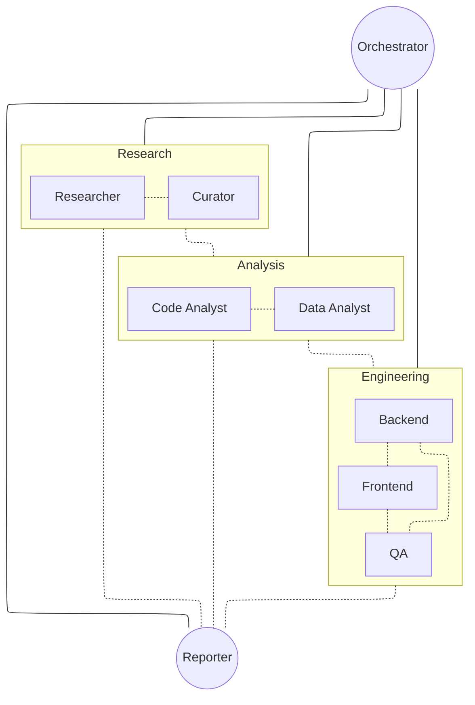

# Research and Modelling Team

A multi-agent research team for designing and building complex modelling frameworks.
Agents are coordinated by a central orchestrator and run in tmux split pane mode.

## Workflow



## Workspace

| Directory | Owner | Purpose |
|---|---|---|
| agent-plan/ | Orchestrator | Implementation plans (gitignored) |
| agent-findings/ | Researcher | Research findings and source logs |
| agent-catalogue/ | Curator | Fetched and catalogued resources |
| agent-analysis/code/ | Code Analyst | Annotated code analysis |
| agent-analysis/data/ | Data Analyst | Data profiling and analysis |
| schema/ | Backend Engineer | API and data model schema |
| agent-report/ | Reporter | Final reports and summaries |
| agent-docs/ | Read-only | Reference documentation |

## Agents

| Agent | Model | Role |
|---|---|---|
| Orchestrator | Opus 4.6 | Central coordinator and decision-maker |
| Researcher | Sonnet | Finds and surfaces sources, spawns sub-agents |
| Curator | Sonnet | Fetches, inspects and catalogues resources |
| Code Analyst | Sonnet | Annotates and analyses source code |
| Data Analyst | Sonnet | Profiles and analyses datasets |
| Backend Engineer | Sonnet | Implements models, APIs, and backend systems |
| Frontend Engineer | Sonnet | Implements user interfaces |
| QA Engineer | Sonnet | Designs and runs integration tests |
| Reporter | Sonnet | Produces reports and summaries |

## Setup

Requires tmux and Claude Code v2.1.32 or later.

Agent teams are enabled via `.claude/settings.json`:

```json
{
  "env": {
    "CLAUDE_CODE_EXPERIMENTAL_AGENT_TEAMS": "1"
  }
}
```

Launch with:

```bash
claude --teammate-mode tmux
```
