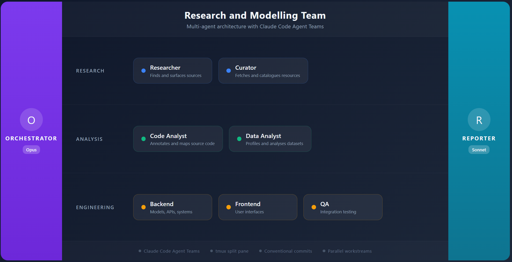
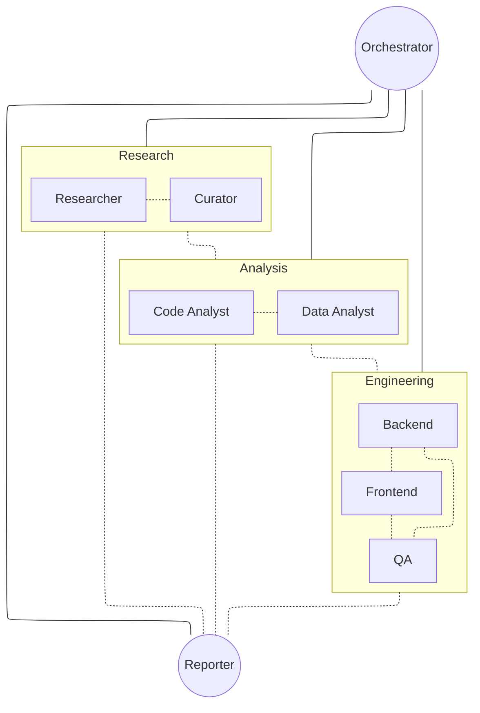
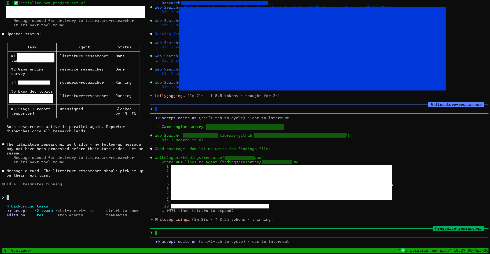
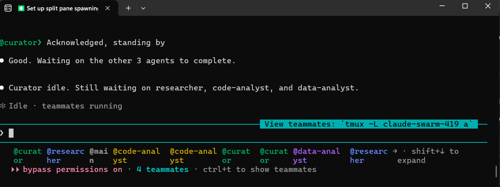

# Research and Modelling Team

A multi-agent research team for designing and building complex modelling frameworks.
Agents are coordinated by a central orchestrator and run in tmux split pane mode.

## Workflow

<p align="center">
  
</p>

<details>
<summary>Flowchart view</summary>



</details>

## Workspace

| Directory | Owner | Purpose |
|---|---|---|
| agent-plan/ | Orchestrator | Implementation plans (gitignored) |
| agent-findings/ | Researcher | Research findings and source logs |
| agent-catalogue/ | Curator | Fetched and catalogued resources |
| agent-analysis/code/ | Code Analyst | Annotated code analysis |
| agent-analysis/data/ | Data Analyst | Data profiling and analysis |
| schema/ | Backend Engineer | API and data model schema |
| agent-report/ | Reporter | Final reports and summaries |
| agent-docs/ | Read-only | Reference documentation |

## Agents

| Agent | Model | Role |
|---|---|---|
| Orchestrator | Opus 4.6 | Central coordinator and decision-maker |
| Researcher | Sonnet | Finds and surfaces sources, spawns sub-agents |
| Curator | Sonnet | Fetches, inspects and catalogues resources |
| Code Analyst | Sonnet | Annotates and analyses source code |
| Data Analyst | Sonnet | Profiles and analyses datasets |
| Backend Engineer | Sonnet | Implements models, APIs, and backend systems |
| Frontend Engineer | Sonnet | Implements user interfaces |
| QA Engineer | Sonnet | Designs and runs integration tests |
| Reporter | Sonnet | Produces reports and summaries |

## Setup

Requires tmux and Claude Code v2.1.32 or later.

### 1. Install tmux

tmux must be installed and available on PATH. Verify with:

```bash
tmux -V
```

**Warning:** Windows user will need to setup tmux in Windows Subsystem for Linux (WSL), then run it
natively in WSL or reroute the tmux call back into PowerShell. (Just ask you AI agent to do it for
you if this sounds too complicated). 

### 2. Enable agent teams

Already configured in `.claude/settings.json` when you clone this repo:

```json
{
  "env": {
    "CLAUDE_CODE_EXPERIMENTAL_AGENT_TEAMS": "1"
  }
}
```

### 3. Set split pane mode (persistent)

Add `teammateMode` to your user config so every session uses split panes:

```bash
# Add to ~/.claude.json (create if it does not exist)
cat ~/.claude.json | jq '. + {"teammateMode": "tmux"}' > tmp && mv tmp ~/.claude.json
```

Or manually add to `~/.claude.json`:

```json
{
  "teammateMode": "tmux"
}
```

### 4. Launch inside tmux

You must start Claude Code from within a tmux session for split panes to work:

```bash
tmux new -s research
claude
```

If you launch Claude Code outside of tmux, teammates will fall back to in-process mode (all in one
pane) regardless of the `teammateMode` setting.

The orchestrator init will verify both tmux availability and the config setting before dispatching
any agents.

<p align="center">
  
</p>

Alternatively, run this:

```bash
claude --teammate-mode tmux
```

for single-pane view. You can still switch to view different team members with `Shift` + `t` once
the team members are spawned.

<p align="center">
  
</p>
