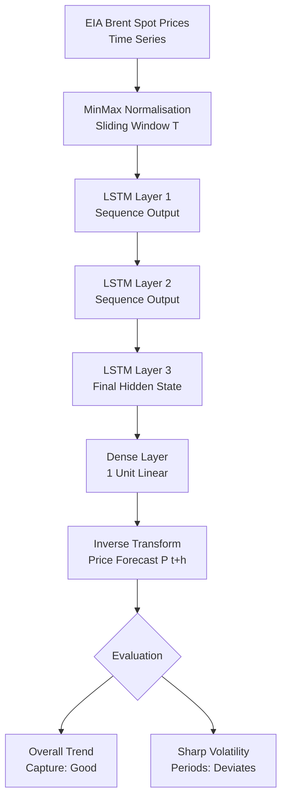

# Code Analysis: Zhao et al. (2024) -- LSTM Brent Price Prediction

**Source:** https://arxiv.org/abs/2409.12376
**Licence:** arXiv standard (no code repository identified)
**Language:** Python (inferred; TensorFlow/Keras or PyTorch ecosystem)
**Catalogue entry:** 012
**Analyst:** Code Analyst (claude-sonnet-4-6)
**Date:** 2026-04-06

---

## 1. Overview

This paper describes a three-layer LSTM model for Brent crude oil price
forecasting. No open-source code or data release is provided. This analysis
documents the architecture described in the paper and provides an implementation
blueprint for the Backend Engineer.

**Relevance rating:** Partially relevant. The LSTM provides a price-level
forecast but NOT a structural model of oil-renewable substitution. Its primary
use is as a price scenario generator for the stress-testing module (simulating
forward oil price paths under different assumptions).

**Limitation:** The abstract notes the model tracks overall price movements but
deviates during sharp volatility periods -- exactly the conditions most important
for stress testing. The GARCH/XGBoost volatility module (entry 014) is a better
fit for stress scenario generation.

---

## 2. Architecture Description

### Three-Layer LSTM

An LSTM cell maintains two state vectors:
- `h_t` (hidden state / short-term memory): output at each timestep
- `c_t` (cell state / long-term memory): carries information across long sequences

Each cell computes:
```
Forget gate:    f_t = sigmoid(W_f * [h_{t-1}, x_t] + b_f)
Input gate:     i_t = sigmoid(W_i * [h_{t-1}, x_t] + b_i)
Candidate:      C~_t = tanh(W_C * [h_{t-1}, x_t] + b_C)
Cell update:    c_t = f_t * c_{t-1} + i_t * C~_t
Output gate:    o_t = sigmoid(W_o * [h_{t-1}, x_t] + b_o)
Hidden state:   h_t = o_t * tanh(c_t)
```

The three-layer stacked architecture:
```
Input (price sequence, length T)
  --> LSTM Layer 1 (h1, c1) -- outputs sequence
  --> LSTM Layer 2 (h2, c2) -- outputs sequence
  --> LSTM Layer 3 (h3, c3) -- outputs final hidden state
  --> Dense (1 unit, linear) -- scalar price forecast
```

### Conceptual Flow Diagram

```
[EIA Brent spot prices: daily/weekly/monthly time series]
        |
        v
[Preprocessing]
  Normalisation to [0,1] (MinMaxScaler on training set)
  Sliding window: sequence of length T -> forecast at t+h
        |
        v
[LSTM Layer 1]  hidden_units=?, dropout=?
        |
        v
[LSTM Layer 2]  hidden_units=?, dropout=?
        |
        v
[LSTM Layer 3]  return_sequences=False (last timestep only)
        |
        v
[Dense(1, activation=linear)]
        |
        v
[Inverse transform (MinMaxScaler)]
        |
        v
[Price Forecast: P_{t+h}]
```

### Mermaid (for reporter)



---

## 3. Implementation Blueprint for Backend Engineer

Since no code is available, the Backend Engineer should implement from scratch.
The following is a minimal reproducible blueprint using PyTorch:

```python
import torch
import torch.nn as nn
import numpy as np
from sklearn.preprocessing import MinMaxScaler

class BrentLSTM(nn.Module):
    """Three-layer stacked LSTM for Brent crude price forecasting.

    Architecture follows Zhao et al. (2024) arXiv:2409.12376.
    Specific hidden_size and dropout are not reported in the paper;
    defaults below are standard choices for financial time series.
    """

    def __init__(self,
                 input_size: int = 1,
                 hidden_size: int = 64,
                 num_layers: int = 3,
                 dropout: float = 0.2,
                 output_size: int = 1):
        super().__init__()
        # Stacked LSTM: num_layers=3 matches paper description.
        # dropout applied between layers (not on last layer).
        self.lstm = nn.LSTM(
            input_size=input_size,
            hidden_size=hidden_size,
            num_layers=num_layers,
            batch_first=True,    # input shape: (batch, seq_len, features)
            dropout=dropout if num_layers > 1 else 0.0
        )
        # Linear head: maps final hidden state to scalar price
        self.linear = nn.Linear(hidden_size, output_size)

    def forward(self, x: torch.Tensor) -> torch.Tensor:
        # x: (batch_size, seq_len, input_size)
        out, _ = self.lstm(x)
        # Take only the last timestep's output
        out = self.linear(out[:, -1, :])
        return out  # (batch_size, output_size)


def make_sequences(series: np.ndarray, seq_len: int):
    """Converts a 1-D price series into (X, y) sliding window pairs."""
    X, y = [], []
    for i in range(len(series) - seq_len):
        X.append(series[i:i + seq_len])
        y.append(series[i + seq_len])
    return np.array(X)[..., np.newaxis], np.array(y)  # add feature dim


def train_lstm(prices: np.ndarray,
               seq_len: int = 30,
               hidden_size: int = 64,
               epochs: int = 100,
               lr: float = 1e-3) -> tuple:
    """Train BrentLSTM on a price series; return model and scaler."""
    scaler = MinMaxScaler()
    scaled = scaler.fit_transform(prices.reshape(-1, 1)).ravel()

    X, y = make_sequences(scaled, seq_len)
    X_t = torch.tensor(X, dtype=torch.float32)
    y_t = torch.tensor(y, dtype=torch.float32).unsqueeze(-1)

    model = BrentLSTM(hidden_size=hidden_size)
    optimiser = torch.optim.Adam(model.parameters(), lr=lr)
    criterion = nn.MSELoss()

    model.train()
    for epoch in range(epochs):
        optimiser.zero_grad()
        preds = model(X_t)
        loss = criterion(preds, y_t)
        loss.backward()
        optimiser.step()

    return model, scaler
```

---

## 4. Patterns and Quality Assessment

**Strengths of the architecture:**
- Stacked LSTM captures hierarchical temporal dependencies:
  Layer 1 learns short-term oscillations, Layer 2 medium-term momentum,
  Layer 3 longer-term structural trends.
- LSTM gates mitigate the vanishing gradient problem affecting plain RNNs
  over long price sequences.
- Framing in the context of low-carbon transition is well-aligned with the
  project objective.

**Weaknesses and risks for CES project:**
- Paper does not report hyperparameters: hidden units, dropout, sequence length,
  learning rate, batch size are all unknown. Implementation requires a
  hyperparameter search.
- No uncertainty quantification: point forecast only. Stress testing requires
  a DISTRIBUTION of price paths, not a single trajectory. This is a fundamental
  limitation.
- Known failure mode: deviation during sharp volatility (precisely the conditions
  of interest for stress testing).
- No attention mechanism: modern variants (Temporal Fusion Transformer, Informer)
  substantially outperform vanilla LSTM on financial time series.
- LSTM is a black box: no interpretability for policy analysis.

**Recommendation for Backend Engineer:**
Do NOT use LSTM as the primary price scenario generator. Instead:
- Use GARCH-based scenario generation (from entry 014) for volatility-regime paths
- Use IMF WP 23/160 (Boer et al.) oil price trajectories directly for stress scenarios
- Reserve LSTM as an OPTIONAL benchmarking component if price forecasting is needed

---

## 5. Security and Anti-Pattern Notes

- MinMaxScaler fitted on training data only; must NOT be refitted on test data
  (data leakage risk). Ensure `scaler.fit_transform(train)` and
  `scaler.transform(test)` pattern.
- Sliding window construction must not leak future data into training sequences.
- For deployment, model weights should be saved with `torch.save(model.state_dict())`
  and validated checksum before use in production pipelines.

---

## 6. Dependency Footprint

```
torch>=2.0    -- LSTM implementation
scikit-learn  -- MinMaxScaler (already in volatility module dependencies)
numpy         -- array operations (already a dependency)
```

**Alternative (lighter):** Keras (tensorflow>=2.12) with `keras.layers.LSTM`.
PyTorch is preferred for the project as it is more compatible with research
workflows and provides dynamic computation graphs.

---

## 7. Recommended Disposition

Given the limitations above, the LSTM analysis is provided for completeness.
The Backend Engineer should:
1. Note the three-layer stacked LSTM pattern as a reference architecture
2. Implement only if a price-trajectory forecasting component is explicitly
   requested beyond the GARCH/scenario-based approach
3. If implemented, use it for benchmarking against simpler AR/ARIMA baselines,
   not as the primary stress scenario generator
