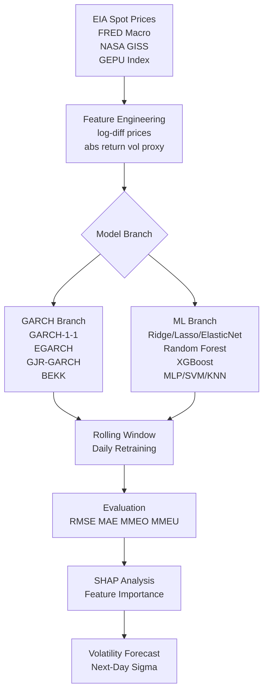

# Code Analysis: Chung (2024) -- GARCH and ML Energy Volatility

**Source:** https://arxiv.org/html/2405.19849v1
**Licence:** arXiv standard (no code repository identified)
**Language:** Python (inferred; scikit-learn / statsmodels / arch ecosystem)
**Catalogue entry:** 014
**Analyst:** Code Analyst (claude-sonnet-4-6)
**Date:** 2026-04-06

---

## 1. Overview

This paper is a comparative methodology study, not an open-source codebase. No
GitHub repository or data release is referenced in the paper. This analysis
documents the architectural patterns, algorithms, and data pipeline described in
the paper that the Backend Engineer can implement in the Python CES library.

**Primary reuse value:** Provides a battle-tested reference architecture for
oil price volatility modelling. The Backend Engineer can implement the
GARCH(1,1) and XGBoost branches as the volatility-generation components of
the stress-testing module.

---

## 2. Conceptual Architecture

### ASCII (for agents)

```
[Raw Data Sources]
    EIA daily spot prices (crude, gasoline, heating oil, natural gas)
    FRED macro indicators (fed funds rate, S&P500, DXY, CPI, PPI, IP, unemployment)
    NASA GISS temperature anomalies
    Global Economic Policy Uncertainty Index (GEPU)
         |
         v
[Feature Engineering]
    Log-difference prices: r_t = log(P_t) - log(P_{t-1})
    Realised variance proxy: sigma_t = |r_t|  (daily abs return as vol proxy)
    Simple diff for non-price series
         |
    +----+----+
    |         |
    v         v
[GARCH Branch]  [ML Branch]
GARCH(1,1)      Linear (Ridge, Lasso, ElasticNet)
EGARCH          Tree (RandomForest, XGBoost)
GJR-GARCH       Neural (MLP)
GARCH-BEKK      Other (SVM, KNN, BayesianRidge)
    |         |
    +----+----+
         |
         v
[Rolling Window Evaluation]
    Train: Jan 2006 - Dec 2019 (3,506 obs)
    Test:  Jan 2020 - Dec 2023 (1,000 obs)
    Models retrained daily on rolling window
         |
         v
[Evaluation Metrics]
    RMSE, MAE, MMEO (overprediction), MMEU (underprediction)
         |
         v
[Interpretability: SHAP/TreeSHAP]
    Feature importance for XGBoost model
    Shapley values identify top drivers of volatility
```

### Mermaid (for reporter)



---

## 3. Algorithm Specifications

### 3.1 GARCH Variants

**GARCH(1,1) -- baseline volatility model**
```
Conditional variance equation:
  sigma^2_t = omega + alpha * epsilon^2_{t-1} + beta * sigma^2_{t-1}

With external regressors (GARCH-X extension):
  sigma^2_t = omega + alpha * epsilon^2_{t-1} + beta * sigma^2_{t-1}
              + sum_i( gamma_i * x_{i,t} )

Parameters: omega > 0, alpha >= 0, beta >= 0, alpha + beta < 1 (stationarity)
Estimation: maximum likelihood (Gaussian or Student-t innovations)
Library: arch (Python); statsmodels.tsa.statespace has GARCH support
```

**EGARCH -- asymmetric shocks (leverage effect)**
```
log(sigma^2_t) = omega + alpha * (|z_{t-1}| - E|z_{t-1}|)
                 + gamma * z_{t-1} + beta * log(sigma^2_{t-1})

gamma < 0 captures leverage effect: negative shocks increase vol more than
positive shocks of equal magnitude.
Library: arch.univariate.EGARCH
```

**GJR-GARCH -- leverage via indicator**
```
sigma^2_t = omega + (alpha + gamma * I_{t-1}) * epsilon^2_{t-1}
            + beta * sigma^2_{t-1}

I_{t-1} = 1 if epsilon_{t-1} < 0 (negative shock), else 0
gamma > 0 implies negative returns increase future volatility.
Library: arch.univariate.GARCH with o=1 argument
```

**GARCH-BEKK -- multivariate volatility (4 assets)**
```
H_t = C'C + A' * epsilon_{t-1} * epsilon'_{t-1} * A + B' * H_{t-1} * B

H_t: (4x4) conditional covariance matrix
A, B: (4x4) coefficient matrices (captures cross-asset volatility spillover)
Key finding: volatility transmits FROM crude oil TO refined products;
natural gas volatility is isolated.
Library: mgarch (Python) or manual implementation via scipy.optimize
```

### 3.2 ML Models

**XGBoost -- top performer in out-of-sample evaluation**
```
Objective: minimise sum_t L(sigma_t, sigma_hat_t) + Omega(f)
where L is squared error (regression) and Omega is L1+L2 regularisation.

Key hyperparameters (from paper context):
  n_estimators: number of boosting rounds
  max_depth: tree depth (controls overfitting)
  learning_rate (eta): shrinkage factor
  subsample: row sampling ratio
  colsample_bytree: feature sampling ratio

Feature importance via SHAP:
  phi_j(v) = sum over subsets S [|S|!(|N|-|S|-1)! / |N|!] * [v(S+j) - v(S)]
  TreeSHAP computes this in O(TLD^2) time (T trees, L leaves, D max depth)

Library: xgboost (Python); shap (Python) for SHAP values
```

**Random Forest**
```
Ensemble of decision trees; bagging with feature subsampling.
Averaged predictions reduce variance; does not overfit as severely as a
single tree on noisy financial data.
Library: sklearn.ensemble.RandomForestRegressor
```

**Ridge Regression (L2)**
```
min sum_t (sigma_t - X_t'beta)^2 + lambda * ||beta||^2
lambda tuned by cross-validation.
Library: sklearn.linear_model.Ridge
```

### 3.3 Loss Functions

```python
# RMSE: standard squared-error metric
rmse = sqrt(mean((sigma_true - sigma_hat)**2))

# MAE: robust to outliers
mae = mean(abs(sigma_true - sigma_hat))

# MMEO: penalises overprediction (over-estimating risk)
mmeo = mean(sigma_hat[sigma_hat > sigma_true]
            - sigma_true[sigma_hat > sigma_true])

# MMEU: penalises underprediction (under-estimating risk -- more dangerous)
mmeu = mean(sigma_true[sigma_hat < sigma_true]
            - sigma_hat[sigma_hat < sigma_true])
```

**Note for stress testing:** MMEU is the more important metric for risk management.
Under-predicting oil price volatility leads to under-provisioned stress scenarios.
The Backend Engineer should use MMEU as the primary optimisation criterion when
calibrating the volatility component of the stress-testing module.

---

## 4. Data Pipeline Specification

```
Dataset: 4,506 daily observations, Jan 2006 -- Dec 2023

Split:
  Training:   Jan 2006 -- Dec 2019 (3,506 obs; 77.8%)
  Validation: 20% of training data (ML hyperparameter tuning)
  Test:        Jan 2020 -- Dec 2023 (1,000 obs; 22.2%)
  Note: test period covers COVID-19 crash (2020), Russian invasion (2022),
  and normalisation (2023) -- rich stress-test coverage.

Feature construction:
  Price returns:       r_t = log(P_t / P_{t-1})
  Volatility proxy:    sigma_t = |r_t|   (realised absolute return)
  Macro features:      first difference (no log; already rates/indices)

Stationarity:
  ADF, PP, KPSS tests confirm all series are I(0) after differencing.
  Jarque-Bera rejects normality (fat tails -- consistent with energy markets).
  Implication: GARCH with Student-t or GED innovations preferred over Gaussian.

Rolling window:
  Models are retrained DAILY on expanding window.
  Each day: fit on all available history, forecast t+1.
  This avoids look-ahead bias and captures regime shifts.
```

---

## 5. Patterns and Quality Assessment

**Strengths of methodology:**
- Dual metric framework (MMEO/MMEU) appropriately distinguishes over/under-prediction
- SHAP interpretability is state-of-the-art for tree models
- Rolling window evaluation is correct for financial time series (no cross-validation)
- Multivariate BEKK captures cross-commodity spillovers

**Limitations and risks for the CES project:**
- No code available: Backend Engineer must implement from scratch using arch/sklearn/xgboost
- BEKK is computationally expensive for large parameter counts;
  for a simple CES model, GARCH(1,1) or GJR-GARCH is sufficient
- The realised-variance proxy (|r_t|) is noisy; the Backend Engineer may prefer
  Parkinson (high-low range) or realised variance from intraday data if available
- Volatility is modelled unconditionally; the CES model needs conditional volatility
  in the context of oil price LEVELS, not just returns

**Code smells (hypothetical, from methodology):**
- Daily retraining for 1,000 test days is computationally intensive if replicated
  naively; for the CES model, monthly retraining is likely sufficient
- No mention of GARCH forecast confidence intervals; stress tests need
  distribution of volatility, not just point forecasts

---

## 6. Reusable Components for Backend Engineer

### Component A: GARCH(1,1) Volatility Module

Implement using the `arch` library (Python). Pattern:

```python
from arch import arch_model
import pandas as pd

def fit_garch(returns: pd.Series,
              vol: str = 'GARCH',
              p: int = 1, q: int = 1,
              dist: str = 't') -> object:
    # vol: 'GARCH', 'EGARCH', or 'GARCH' with o=1 for GJR-GARCH
    # dist: 't' (Student-t) preferred for fat-tailed energy returns
    # Rescale returns to percent (arch convention: 100 * log return)
    model = arch_model(returns * 100, vol=vol, p=p, q=q, dist=dist)
    result = model.fit(disp='off', show_warning=False)
    return result

def forecast_volatility(fit_result, horizon: int = 1) -> float:
    # Returns annualised conditional volatility forecast
    forecast = fit_result.forecast(horizon=horizon)
    return float(forecast.variance.values[-1, 0] ** 0.5)
```

### Component B: XGBoost Volatility Predictor + SHAP

Implement using `xgboost` and `shap` libraries. Pattern:

```python
import xgboost as xgb
import shap
import numpy as np

def train_xgb_volatility(X_train, y_train,
                          params: dict = None) -> xgb.XGBRegressor:
    # Default params calibrated from paper findings
    default_params = {
        'n_estimators': 300,
        'max_depth': 4,
        'learning_rate': 0.05,
        'subsample': 0.8,
        'colsample_bytree': 0.8,
        'objective': 'reg:squarederror'
    }
    if params:
        default_params.update(params)
    model = xgb.XGBRegressor(**default_params)
    model.fit(X_train, y_train)
    return model

def shap_importance(model: xgb.XGBRegressor,
                    X: np.ndarray) -> dict:
    # TreeSHAP: fast exact Shapley values for tree ensembles
    explainer = shap.TreeExplainer(model)
    shap_values = explainer.shap_values(X)
    # Mean absolute SHAP per feature = global importance ranking
    importance = dict(zip(model.feature_names_in_,
                          np.abs(shap_values).mean(axis=0)))
    return dict(sorted(importance.items(), key=lambda x: -x[1]))
```

### Component C: Feature Engineering Pipeline

```python
import pandas as pd
import numpy as np

def build_volatility_features(df: pd.DataFrame) -> pd.DataFrame:
    # df must have columns: price_oil, plus any macro series
    # Returns log-differenced prices and simple-differenced macro vars
    out = pd.DataFrame(index=df.index)

    # Log returns for price series (stationary, unit-free)
    for col in ['price_oil', 'price_gas']:
        out[f'ret_{col}'] = np.log(df[col]).diff()

    # Absolute return as volatility proxy
    out['vol_proxy'] = out['ret_price_oil'].abs()

    # Simple difference for rates/indices
    for col in ['fed_funds_rate', 'gepu', 'sp500']:
        if col in df.columns:
            out[f'd_{col}'] = df[col].diff()

    return out.dropna()
```

### Component D: Evaluation Metrics

```python
import numpy as np

def evaluate_vol_forecast(y_true: np.ndarray,
                           y_hat: np.ndarray) -> dict:
    residuals = y_hat - y_true
    return {
        'rmse': float(np.sqrt(np.mean(residuals**2))),
        'mae':  float(np.mean(np.abs(residuals))),
        # MMEO: mean magnitude of over-predictions
        'mmeo': float(np.mean(residuals[residuals > 0]))
               if any(residuals > 0) else 0.0,
        # MMEU: mean magnitude of under-predictions (more critical)
        'mmeu': float(np.mean(-residuals[residuals < 0]))
               if any(residuals < 0) else 0.0,
    }
```

---

## 7. Integration Architecture for CES Volatility Module

The Backend Engineer should implement a `volatility/` subpackage:

```
[ces_model package]
  volatility/
    garch.py      -- GARCH/EGARCH/GJR-GARCH wrapper (arch library)
    xgb_vol.py    -- XGBoost volatility predictor + SHAP importance
    features.py   -- log-return and macro feature engineering pipeline
    evaluate.py   -- RMSE, MAE, MMEO, MMEU metrics
    regimes.py    -- classify vol regime: low/medium/high (for scenario mapping)
```

**Regime mapping for stress tests:**
- Low volatility (sigma < 10th percentile): NGFS Current Policies baseline
- Medium volatility (10th-75th percentile): NGFS Delayed Transition
- High volatility (> 75th percentile): NGFS Net Zero 2050 / geopolitical shock

---

## 8. Key Dependencies

```
arch>=5.0          -- GARCH/EGARCH/GJR-GARCH/BEKK estimation
xgboost>=1.7       -- gradient-boosted trees
shap>=0.42         -- TreeSHAP feature importance
scikit-learn>=1.2  -- Ridge, Lasso, RF, MLP, SVM, KNN
pandas>=2.0        -- time series handling
statsmodels>=0.14  -- ADF/PP/KPSS stationarity tests
```

All are pip/uv installable and MIT or BSD licenced.
