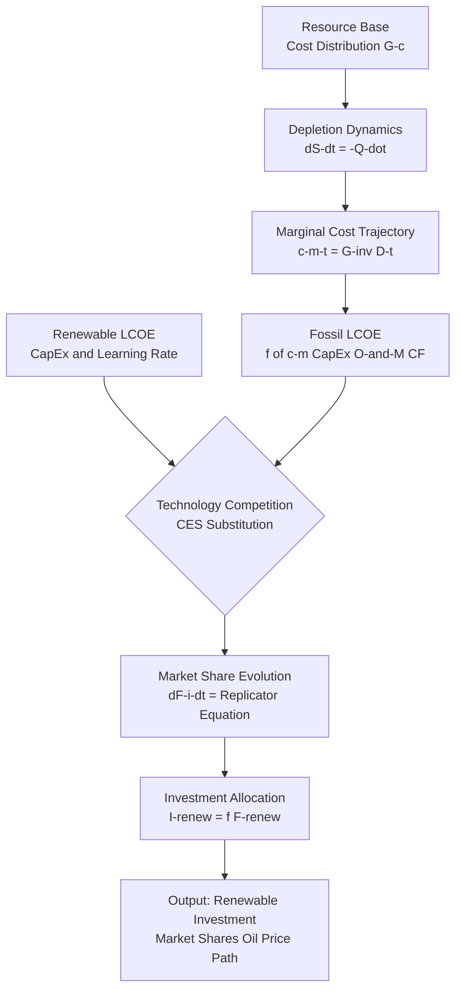

# Code Analysis: Mercure and Salas (2013) -- FTT:Power Marginal Cost Model

**Source:** https://arxiv.org/abs/1209.0708 / Energy Policy 63 (2013)
**Licence:** No open-source code identified; published journal paper
**Language:** Fortran/Python (FTT:Power model; supplementary code not confirmed)
**Catalogue entry:** 035
**Analyst:** Code Analyst (claude-sonnet-4-6)
**Date:** 2026-04-06

---

## 1. Overview

The Mercure/Salas paper presents a mathematical framework for modelling the
endogenous evolution of marginal production costs for non-renewable energy
resources. It is implemented within the FTT:Power (Future Technology
Transformations: Power) global power sector model. No standalone open-source
code repository was found from the arXiv abstract or Energy Policy supplementary
materials.

**Relevance to CES model:** High for the Backend Engineer. The marginal cost
distribution framework provides a rigorous method for connecting Brent oil
price levels to production cost dynamics over time -- directly applicable to
parameterising the CES substitution model's cost side.

---

## 2. Mathematical Framework

### Core Concept: Global Cost Distribution

The model treats the aggregate of non-renewable energy resources as a
distribution of marginal extraction costs. Rather than a single supply curve,
resources are distributed across cost bins, reflecting heterogeneous extraction
conditions globally.

```
Conceptual notation (reconstructed from abstract and standard FTT literature):

Let G(c, t) = cumulative distribution of resource supply at cost c at time t
              (fraction of total resource extractable at cost <= c)

Marginal cost of supply at time t:
  c_m(t) = G^{-1}(Q(t) / Q_max)
          = inverse CDF evaluated at the depletion fraction

where:
  Q(t)    = cumulative production up to time t
  Q_max   = total recoverable resource (resource base)
  G^{-1}  = inverse of the cumulative cost distribution
```

### Bidirectional Calculation

The framework supports two calculation directions:

**Forward (price -> quantity):**
Given an exogenous commodity price path P(t), compute resource flow Q_dot(t):
```
Q_dot(t) = demand(P(t), other_factors)
         = f(P_oil(t), P_renewable(t), elasticities, macro_variables)
```

**Inverse (quantity -> cost):**
Given an exogenous demand path Q_dot(t), back out the implied marginal cost:
```
c_m(t) = G^{-1}(Q(t) / Q_max)
```

This is the key operation for the CES model: when renewable substitution
reduces oil demand Q(t), the remaining marginal cost trajectory can be
computed, enabling forward price scenarios consistent with depletion dynamics.

### Depletion Dynamics

```
Resource stock evolution:
  dS/dt = -Q_dot(t)
  S(t) = S_0 - integral[0,t] Q_dot(tau) d(tau)

Depletion fraction:
  D(t) = 1 - S(t) / S_0 = Q(t) / Q_max

Marginal cost trajectory:
  c_m(t) = G^{-1}(D(t))

As D(t) -> 1 (resource exhaustion):
  c_m(t) -> infinity   (reflects rising extraction costs for remaining resources)
```

---

## 3. FTT:Power Technology Competition Framework

FTT:Power models technology substitution between energy sources using a
logistic differential equation system. This is the structural origin of the
CES-style substitution the Backend Engineer needs to implement.

### Market Share Dynamics

```
Let F_i(t) = market share of technology i at time t
Let c_i(t) = levelised cost of technology i (includes capital, O&M, fuel)

Share dynamics follow a replicator equation:
  dF_i/dt = F_i * sum_j[ A_{ij} * F_j * (c_j - c_i) / (c_i + c_j) ]

where:
  A_{ij}  = pairwise substitution rate coefficient (technology compatibility)
  c_i     = levelised cost of technology i
  c_j     = levelised cost of technology j

When c_j > c_i (technology i is cheaper), F_i grows at expense of F_j.
When c_i = c_j, market shares are stable.
```

**Connection to CES model:**
The replicator equation is a discrete analogue of the CES substitution function.
The CES elasticity sigma in Papageorgiou et al. (2017) corresponds to the
sensitivity of market share shifts to relative cost differentials. Higher sigma
means faster substitution to the cheaper technology.

### Cost Structure

```
Levelised Cost of Technology i:
  LCOE_i = (CapEx_i * CRF + O&M_i) / CF_i + fuel_i

where:
  CapEx_i = capital cost per MW installed
  CRF     = capital recovery factor = r(1+r)^n / ((1+r)^n - 1)
  O&M_i   = operating and maintenance cost
  CF_i    = capacity factor
  fuel_i  = fuel cost (= f(c_m(t)) for fossil fuels via marginal cost trajectory)

Key link: fuel_i for oil-based generation = function of c_m(t) from depletion model
This creates the coupling between oil price dynamics and renewable competitiveness.
```

---

## 4. Architecture Diagram

### ASCII (for agents)

```
[Resource Base: G(c) distribution]
    |
    v
[Depletion Dynamics]
  dS/dt = -Q_dot(t)
  D(t) = Q(t) / Q_max
    |
    v
[Marginal Cost Trajectory]
  c_m(t) = G^{-1}(D(t))
    |
    v
[Levelised Cost Calculation]
  LCOE_fossil(t) = f(c_m(t), CapEx, O&M, CF)
  LCOE_renew(t)  = f(CapEx_renew, learning_rate, installed_base)
    |
    v
[Technology Competition / CES Substitution]
  dF_i/dt = replicator(F, LCOE_i, LCOE_j)
  -- or equivalently --
  Q_renew / Q_fossil = (LCOE_fossil / LCOE_renew)^sigma   (CES form)
    |
    v
[Investment Allocation]
  I_renew(t) = f(F_renew(t), market_size, policy_variables)
    |
    v
[Model Output]
  Renewable investment trajectory I_renew(t)
  Market share evolution F_i(t)
  Implied oil price path P_oil(t)
```

### Mermaid (for reporter)



---

## 5. Implementation Blueprint for Backend Engineer

The Backend Engineer should implement the cost distribution and depletion
logic as part of the CES model's supply-side module:

```python
import numpy as np
from scipy import interpolate
from typing import Callable

class MarginalCostModel:
    """Marginal cost trajectory model following Mercure and Salas (2013).

    Models the evolution of non-renewable energy marginal production costs
    as a function of cumulative depletion, using a cost distribution G(c).

    Parameters
    ----------
    cost_bins : np.ndarray
        Array of cost values (e.g., $/bbl) representing the cost distribution
    cumulative_supply : np.ndarray
        Fraction of total resource extractable at each cost bin (CDF values,
        i.e., G(c) -- must be monotonically increasing from 0 to 1)
    total_resource : float
        Total recoverable resource (e.g., billion barrels of oil)
    initial_depletion : float
        Fraction of resource already depleted at model start (default: 0.3
        for current Brent context; roughly 1 trillion bbls produced / ~3.3T total)
    """

    def __init__(self,
                 cost_bins: np.ndarray,
                 cumulative_supply: np.ndarray,
                 total_resource: float,
                 initial_depletion: float = 0.3):
        # Build inverse CDF interpolator: D(t) -> c_m(t)
        # This is the core G^{-1} operation from the paper.
        # Use linear interpolation; can be upgraded to cubic for smoother curves.
        self._inverse_cdf: Callable = interpolate.interp1d(
            cumulative_supply, cost_bins,
            kind='linear', fill_value='extrapolate'
        )
        self.total_resource = total_resource
        self.cumulative_production = initial_depletion * total_resource

    def marginal_cost(self) -> float:
        """Current marginal cost given accumulated depletion."""
        depletion_fraction = self.cumulative_production / self.total_resource
        # Clip to [0, 1] to avoid extrapolation errors at model boundaries
        depletion_fraction = float(np.clip(depletion_fraction, 0.0, 0.999))
        return float(self._inverse_cdf(depletion_fraction))

    def step(self, production_rate: float, dt: float = 1.0) -> float:
        """Advance model by dt years, consuming production_rate (billion bbls/yr).

        Returns the marginal cost at the new depletion level.
        """
        self.cumulative_production += production_rate * dt
        return self.marginal_cost()

    def simulate(self, production_path: np.ndarray, dt: float = 1.0) -> np.ndarray:
        """Simulate marginal cost trajectory given a production path.

        Parameters
        ----------
        production_path : np.ndarray
            Annual production rates (e.g., billion bbls/yr) over model horizon
        dt : float
            Time step in years (default 1.0 = annual)

        Returns
        -------
        np.ndarray
            Marginal cost at each time step
        """
        costs = np.empty(len(production_path))
        for t, q in enumerate(production_path):
            costs[t] = self.step(q, dt)
        return costs
```

### Parameter Calibration Note

The cost distribution G(c) can be constructed from IEA/EIA supply curve data:
- EIA provides cost estimates by production region (ultra-deepwater, shale, etc.)
- Standard assumption: log-normal cost distribution with mean ~$30/bbl,
  std ~$25/bbl (consistent with Brent price history of $20-$140/bbl range)
- Total recoverable oil resource: ~3.3 trillion barrels (IEA estimate)
- Current depletion fraction: ~33% (roughly 1.1 trillion barrels produced)

---

## 6. CES Substitution Integration

The marginal cost model feeds into the CES substitution function. The Backend
Engineer should implement the link as follows:

```python
def ces_substitution(
    price_oil: float,           # P_oil from market or marginal cost model
    price_renew: float,         # Levelised cost of renewable (LCOE_renew)
    elasticity_sigma: float,    # Substitution elasticity (1.8 from Papageorgiou)
    alpha: float = 0.5,         # CES share parameter for renewables
) -> dict:
    """Constant Elasticity of Substitution production function.

    Computes the cost-minimising input ratio between renewable and fossil
    energy given relative prices and the substitution elasticity.

    CES unit cost function:
      C(p_oil, p_renew) = [alpha * p_renew^{1-sigma}
                           + (1-alpha) * p_oil^{1-sigma}]^{1/(1-sigma)}

    Cost-minimising input ratio (from cost minimisation):
      Q_renew / Q_oil = (alpha / (1-alpha)) * (p_oil / p_renew)^sigma

    Parameters
    ----------
    price_oil : float
        Marginal cost / market price of fossil fuel ($/bbl equivalent)
    price_renew : float
        Levelised cost of renewable energy ($/MWh, normalised)
    elasticity_sigma : float
        Elasticity of substitution. sigma > 1 => gross substitutes.
        Use 1.8 from Papageorgiou et al. (2017) as baseline.
    alpha : float
        CES distribution parameter for renewables (calibrated to data)

    Returns
    -------
    dict with keys:
        ratio: Q_renew / Q_oil (dimensionless)
        unit_cost: aggregate unit cost index
        renew_share: renewable share of total energy = ratio / (1 + ratio)
    """
    rho = (elasticity_sigma - 1.0) / elasticity_sigma  # CES exponent

    # Cost-minimising ratio: (alpha/(1-alpha)) * (p_oil/p_renew)^sigma
    ratio = (alpha / (1.0 - alpha)) * (price_oil / price_renew) ** elasticity_sigma

    # CES unit cost (for welfare/investment calculations)
    unit_cost = (alpha * price_renew ** (1.0 - elasticity_sigma)
                 + (1.0 - alpha) * price_oil ** (1.0 - elasticity_sigma)
                 ) ** (1.0 / (1.0 - elasticity_sigma))

    renew_share = ratio / (1.0 + ratio)

    return {
        'ratio': float(ratio),
        'unit_cost': float(unit_cost),
        'renew_share': float(renew_share),
    }
```

---

## 7. Patterns and Quality Assessment

**Strengths of the Mercure/Salas framework:**
- Endogenous cost trajectory: links physical depletion to price formation,
  avoiding the need for exogenous price assumptions in the long run
- Bidirectionality: can be driven by price OR quantity, enabling both
  demand-side and supply-side scenario analysis
- Continuous-time formulation: suitable for ODE-based simulation
- Compatible with CES: the replicator equation is structurally equivalent
  to the CES substitution condition, providing theoretical coherence

**Limitations for the CES project:**
- No open-source code: full FTT:Power implementation is proprietary;
  Backend Engineer must implement the mathematical framework from scratch
- The distribution G(c) requires calibration to a specific resource base;
  global oil cost distributions are available from IEA but require curating
- Depletion dynamics operate on decadal timescales; the model horizon
  (2025-2035 for stress tests) may not exhibit significant depletion effects
  unless renewable substitution is aggressive
- The replicator equation is more complex than a simple CES ratio and may
  be over-engineering for a stress-test-focused project

**Recommendation:**
Implement the simplified CES form (ces_substitution function above) as the
core model, with the MarginalCostModel as an OPTIONAL long-run extension.
For the 10-year stress test horizon, parameterise oil price exogenously
from NGFS/IEA scenarios rather than from endogenous depletion dynamics.

---

## 8. Key Dependencies

```
numpy>=1.24    -- array operations and interpolation
scipy>=1.10    -- interpolate.interp1d for G^{-1} CDF
pandas>=2.0    -- time series simulation output
```

No new dependencies beyond the standard scientific Python stack.
