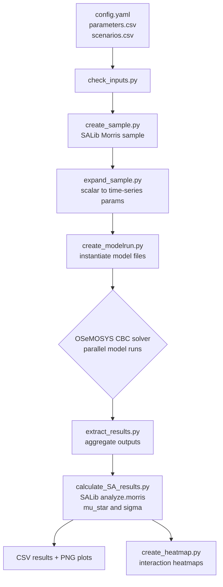

# Code Analysis: Usher et al. (2023) -- esom_gsa

**Source:** https://github.com/KTH-dESA/esom_gsa
**Licence:** MIT
**Language:** Python (73.4% Jupyter Notebook, 26.4% Python scripts)
**Catalogue entry:** 059
**Analyst:** Code Analyst (claude-sonnet-4-6)
**Date:** 2026-04-06

---

## 1. Repository Structure

```
esom_gsa/
 ├── config/
 │    ├── config.yaml          -- central workflow config (solver, replicates, seed)
 │    ├── scenarios.csv        -- maps master models to macro scenarios
 │    ├── parameters.csv       -- parameter ranges (min/max, dist, interpolation)
 │    └── results.csv          -- OSeMOSYS output variables to analyse
 ├── workflow/
 │    ├── Snakefile            -- main DAG definition; orchestrates all rules
 │    ├── rules/
 │    │    ├── sample.smk      -- sampling rules
 │    │    ├── osemosys.smk    -- model execution rules (CBC solver)
 │    │    ├── results.smk     -- result aggregation rules
 │    │    └── paper.smk       -- paper figure generation rules
 │    ├── scripts/
 │    │    ├── create_sample.py     -- Morris sample generation (SALib)
 │    │    ├── expand_sample.py     -- scalar sample -> time-series parameters
 │    │    ├── scale_sample.py      -- normalised -> physical units
 │    │    ├── calculate_SA_results.py -- SA index calculation and plotting
 │    │    ├── utils.py             -- shared helpers (SALib problem builder)
 │    │    ├── extract_results.py   -- parse OSeMOSYS output CSVs
 │    │    ├── create_modelrun.py   -- instantiate model from sample row
 │    │    ├── check_inputs.py      -- validate config before run
 │    │    └── create_heatmap.py    -- heatmap visualisation
 │    ├── notebooks/           -- Jupyter tutorials and visualisation
 │    └── envs/                -- Conda environment YAML specs
 └── resources/                -- template files
```

---

## 2. Dependency Map

### ASCII (for agents)

```
config.yaml / parameters.csv / scenarios.csv
        |
        v
[check_inputs.py]           -- validate user config
        |
        v
[create_sample.py]          -- SALib.sample.morris -> unscaled_sample.txt
        |
        v
[expand_sample.py]          -- unscaled_sample -> per-run CSV parameter files
        |
        v
[create_modelrun.py]        -- instantiate OSeMOSYS data files per model run
        |
        v
[OSeMOSYS / CBC solver]     -- parallel model runs (Snakemake scatter)
        |
        v
[extract_results.py]        -- parse result CSVs -> aggregated DataFrame
        |
        v
[calculate_SA_results.py]   -- SALib.analyze.morris -> Si (mu*, sigma) -> CSV + PNG
        |
        v
[create_heatmap.py]         -- interaction plots across parameters
```

### Mermaid (for reporter)



---

## 3. Annotated Key Scripts

### 3.1 `utils.py` -- `create_salib_problem()`

```python
def create_salib_problem(parameters: List) -> Dict:
    # Builds the SALib problem dict that is the universal interface for
    # both sampling (SALib.sample.morris) and analysis (SALib.analyze.morris).
    # All bounds are normalised to [0, 1] here; physical scaling is deferred
    # to expand_sample.py so that SALib treats every parameter identically.
    problem = {}
    problem['num_vars'] = len(parameters)
    # GUARD: Morris requires at least 2 variables and 2 groups.
    # Single-variable problems would produce degenerate trajectories.
    if problem['num_vars'] <= 1:
        raise ValueError(...)

    names, bounds, groups = [], [], []
    for parameter in parameters:
        # Name encodes both parameter name and index (region/technology).
        # Semicolon separator chosen so names remain CSV-safe.
        names.append(parameter['name'] + ";" + parameter['indexes'])
        groups.append(parameter['group'])
        # Uniform [0,1] bounds: all physical scaling happens downstream,
        # keeping SALib agnostic of units and model internals.
        bounds.append([0, 1])

    problem['names'] = names
    problem['bounds'] = bounds
    problem['groups'] = groups        # grouped Morris: one EE per group
    # GUARD: at least 2 distinct groups required for grouped Morris method.
    num_groups = len(set(groups))
    if num_groups <= 1:
        raise ValueError(...)
    return problem
```

**Pattern:** Normalise-first, scale-later. Decouples SALib from model internals.
**Reuse signal:** Directly portable. Swap `parameter['name'] + ";" + parameter['indexes']`
for any parameter identifier scheme.

---

### 3.2 `create_sample.py` -- Morris Sample Generation

```python
def main(parameters: dict, sample_file: str, replicates: int):
    # Step 1: build SALib problem (normalised bounds)
    problem = utils.create_salib_problem(parameters)

    # Step 2: generate optimal Morris trajectories
    # N=100: pool of candidate trajectories to draw from
    # optimal_trajectories=replicates: select the most space-filling subset
    # local_optimization=True: greedy local search (faster than exhaustive)
    # seed=42: reproducibility -- critical for auditable sensitivity analysis
    sample = morris.sample(problem, N=100,
                           optimal_trajectories=replicates,
                           local_optimization=True, seed=42)

    # Step 3: persist as plain CSV for downstream scripts
    np.savetxt(sample_file, sample, delimiter=',')
```

**Pattern:** Optimal trajectory selection. The pool (N=100) is larger than the
desired replicates so the algorithm can pick geometrically diverse trajectories,
improving coverage of the parameter space.

**Computational cost:** 10 * (k+1) runs where k = number of parameter GROUPS.
For a 10-parameter model with replicates=10: 110 model runs. This is the key
efficiency advantage over Sobol (which needs ~500*(k+2)).

**Reuse signal:** `morris.sample(problem, N=100, optimal_trajectories=replicates,
local_optimization=True, seed=42)` is a drop-in call pattern. Only `problem`
and `replicates` need customisation for the CES model.

---

### 3.3 `expand_sample.py` -- Scalar to Time-Series Expansion

```python
def assign_sample_value(min_value, max_value, sample):
    # Linear interpolation from normalised [0,1] sample value
    # to physical [min_value, max_value] range.
    # Using np.interp keeps it vectorisable.
    return np.interp(sample, [0, 1], [min_value, max_value])

def main(morris_sample, parameters, output_files):
    for model_run, sample_row in enumerate(morris_sample):
        # Each model run gets its own CSV file of parameter values.
        # This flat-file approach decouples model runs from each other --
        # enables embarrassingly parallel execution.
        for column, param in zip(sample_row, parameters):
            # Base year and end year can have different uncertainty bounds,
            # allowing parameters to widen or narrow over the model horizon.
            # Fixed endpoints (min == max) are short-circuited to avoid
            # floating-point noise from near-equal interpolation.
            if math.isclose(min_by, max_by):
                value_base_year = min_by
            else:
                value_base_year = (max_by - min_by) * column + min_by
            # ... same for end year
```

**Pattern:** Flat-file parameter isolation per model run. No shared mutable state
between runs. Each run reads its own CSV and writes to its own output directory.

**Reuse signal:** The `assign_sample_value` pattern (linear interp from [0,1]) is
directly reusable for mapping Morris samples to CES model parameters
(e.g., substitution elasticity sigma in [1.0, 2.5], oil price in [$30, $120]).

---

### 3.4 `calculate_SA_results.py` -- Analysis and Visualisation

```python
def sa_results(parameters, X, Y, save_file, scaled=False):
    problem = utils.create_salib_problem(parameters)
    # SALib analyze returns Si dict with keys: mu, mu_star, sigma,
    # mu_star_conf (bootstrap confidence interval on mu_star).
    Si = analyze_morris.analyze(problem, X, Y,
                                print_to_console=False, scaled=scaled)

    # Persist sensitivity indices as CSV (machine-readable for other agents)
    Si.to_df().to_csv(f'{save_file}.csv')

    # Dual visualisation:
    # (1) horizontal_bar_plot: ranks parameters by mu_star (primary influence)
    # (2) covariance_plot: mu_star vs sigma scatter (identifies nonlinear/
    #     interaction effects -- parameters in top-right are both influential
    #     AND exhibit interaction/nonlinearity)
    fig, axs = plt.subplots(2, figsize=(10,8))
    plot_morris.horizontal_bar_plot(axs[0], Si, unit=unit)
    plot_morris.covariance_plot(axs[1], Si, unit=unit)
    fig.savefig(f'{save_file}.png', bbox_inches='tight')
```

**Pattern:** Dual output (CSV + PNG). CSV feeds downstream agents; PNG feeds
reporter. The mu*/sigma covariance plot is the canonical Morris visualisation:
parameters with high mu* AND high sigma need variance-based follow-up (Sobol).

**Output schema for Backend Engineer:**
```
parameter_name, mu, mu_star, sigma, mu_star_conf
oil_price_shock, 0.43, 0.43, 0.12, 0.05
elasticity_sigma, 0.38, 0.38, 0.28, 0.06  # high sigma -> interaction effects
discount_rate, 0.11, 0.11, 0.04, 0.02
...
```

---

### 3.5 `Snakefile` -- Workflow Orchestration Pattern

```python
# Number of model runs = (groups + 1) * replicates
# This is the Morris formula: each group gets one elementary effect per replicate
MODELRUNS = range((len(GROUPS) + 1) * config['replicates'])

# Rule `all` declares final outputs -- Snakemake resolves the DAG backwards
rule all:
    input:
        expand("results/{scenario}_summary/SA_objective.{extension}",
               scenario=SCENARIOS.index, extension=['csv', 'png']),
        ...

# onstart hook validates inputs before any computation starts
onstart:
    if "skip_checks" not in config:
        shell("python workflow/scripts/check_inputs.py {}".format(config_path))
```

**Pattern:** Declarative DAG with input validation hook. The `expand()` call
generates all expected output paths; Snakemake figures out what to run.
Parallelism is implicit: all model runs in the scatter phase are independent.

---

## 4. Complexity Assessment

| Module | Cyclomatic Complexity | Notes |
|---|---|---|
| `create_sample.py` | Low | Thin wrapper over SALib; main logic is 10 lines |
| `expand_sample.py` | Low-Medium | Linear loop; branch for fixed vs interpolated endpoints |
| `calculate_SA_results.py` | Medium | Dual output paths (objective vs variable); plot logic |
| `utils.py` | Low | Helper functions; clean interfaces |
| `Snakefile` | Medium | Declarative; complexity lies in wildcard resolution |

**Lines of Python (scripts only):** ~600 lines excluding tests.
**Test coverage:** 4 test files present (`test_create_heatmap.py`,
`test_create_modelrun.py`, `test_extract_results.py`, `test_utils.py`).

---

## 5. Code Patterns and Quality

**Strengths:**
- Clean separation of concerns: sampling, parameter expansion, model execution,
  and analysis are independent stages connected by flat files
- Reproducibility via fixed seed (seed=42 in Morris sampler)
- Type hints on all function signatures
- Docstrings on all public functions with argument/return documentation
- Validation guards (min 2 variables, min 2 groups) prevent silent errors
- Test suite covers core utility functions

**Code smells / concerns:**
- `transform_31072013.py` -- legacy transformation script with a date in the
  filename; suggests a one-off fix that was never cleaned up. Not referenced
  in main workflow.
- `osemosys_run.sh` -- shell script for model execution; could be fragile on
  Windows (uses bash shebang). Not relevant to the Python library reuse.
- Hardcoded magic string `"skip_checks"` as config key -- undocumented escape
  hatch in Snakefile. Minor.
- `files_to_remove` list in Snakefile comments "bug in otoole 1.0.4" -- a
  workaround that should be tracked as a dependency version pin.

**Security concerns:** None material. No user-facing inputs, no SQL, no network
calls at runtime (network only in `retrieve_zenodo_data.py` for data download).

---

## 6. Reusable Components for Backend Engineer

The Backend Engineer should extract or adapt these four components into the
Python CES library:

### Component A: SALib Problem Builder
**File:** `utils.py:create_salib_problem()`
**What it does:** Translates a list of parameter dicts (name, group, min, max)
into the SALib `problem` dict that drives both sampling and analysis.
**Adaptation needed:** Replace `parameter['indexes']` with CES model parameter
identifiers (e.g., `sigma`, `alpha`, `oil_price_baseline`). Remove the
OSeMOSYS-specific semicolon-encoded index format.

### Component B: Morris Sampler
**File:** `create_sample.py:main()`
**What it does:** Generates optimal Morris trajectories as a numpy array.
**Adaptation needed:** Wrap as a function `generate_morris_sample(parameters,
replicates, seed)` returning a numpy array. No Snakemake dependency needed
for the library; call SALib directly.
**Minimal standalone version:**
```python
from SALib.sample import morris
import numpy as np

def generate_morris_sample(problem: dict, replicates: int = 10,
                            seed: int = 42) -> np.ndarray:
    # N=100 pool ensures diverse trajectory selection.
    # optimal_trajectories=replicates selects space-filling subset.
    return morris.sample(problem, N=100,
                         optimal_trajectories=replicates,
                         local_optimization=True, seed=seed)
```

### Component C: Parameter Expansion (Time-Series Aware)
**File:** `expand_sample.py:main()`
**What it does:** Maps normalised [0,1] sample values to physical parameter
ranges, supporting both fixed and time-interpolated parameters.
**Adaptation for CES model:** The time-interpolation pattern is directly
applicable to oil price scenario paths: a parameter can have a 2025 baseline
value and a 2035 end value, with Morris exploring the full trajectory space.

### Component D: Sensitivity Analysis Runner + Dual Output
**File:** `calculate_SA_results.py:sa_results()`
**What it does:** Computes mu, mu*, sigma from model outputs; saves CSV + PNG.
**Adaptation needed:** Replace OSeMOSYS-specific result parsing with the CES
model output schema (e.g., renewable_investment_delta, substitution_fraction).

---

## 7. Integration Architecture for CES Stress-Testing Module

```
[stress_test module]
  gsa/
    problem.py       -- adapted create_salib_problem() for CES parameters
    sampler.py       -- adapted generate_morris_sample()
    expander.py      -- adapted expand_sample() for oil price paths
    runner.py        -- calls CES model for each sample row
    analyser.py      -- adapted sa_results() for CES outputs
    visualise.py     -- reuse SALib plotting calls directly
  config/
    parameters.yaml  -- substitution elasticity, oil price, discount rate ranges
    scenarios.yaml   -- NGFS/IEA scenario definitions
```

**Snakemake is NOT required** for the library. The flat-file parallelism pattern
can be replaced by `multiprocessing.Pool` or `concurrent.futures` for simpler
deployment. Snakemake adds value for HPC cluster runs beyond library scope.

---

## 8. Key Dependency: SALib

SALib (Sensitivity Analysis Library) is the only non-standard dependency
for the GSA component. It is MIT-licenced, actively maintained, and pip-installable.

```
pip install SALib  # or: uv add SALib
```

The three SALib calls needed:
1. `SALib.sample.morris.sample(problem, N, optimal_trajectories, seed)`
2. `SALib.analyze.morris.analyze(problem, X, Y)`
3. `SALib.plotting.morris` (optional; can be replaced with matplotlib)
